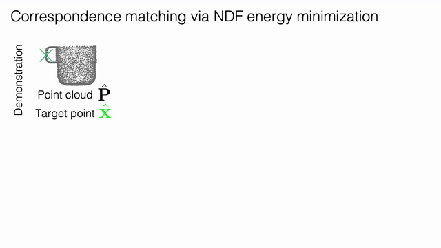
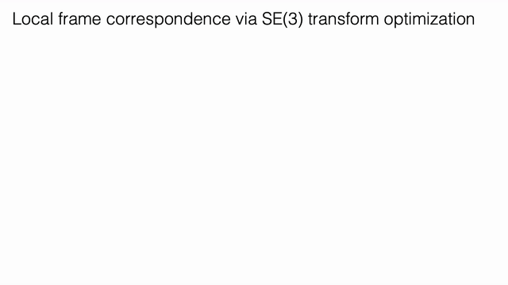

# Neural Descriptor Fields (NDF)

PyTorch implementation for training continuous 3D neural fields to represent dense correspondence across objects, and using these descriptor fields to mimic demonstrations of a pick-and-place task on a robotic system

<p align="center">

</p>

---

This is the reference implementation for our paper:

### Neural Descriptor Fields: SE(3)-Equivariant Object Representations for Manipulation
<p align="center">


</p>

[PDF](https://arxiv.org/abs/2112.05124) | [Video](https://youtu.be/dXl9xI2LrRw)

[Anthony Simeonov*](https://anthonysimeonov.github.io/), [Yilun Du*](https://yilundu.github.io/), [Andrea Tagliasacchi](https://taiya.github.io/), [Joshua B. Tenenbaum](http://web.mit.edu/cocosci/josh.html), [Alberto Rodriguez](http://meche.mit.edu/people/faculty/ALBERTOR@MIT.EDU), [Pulkit Agrawal**](http://people.csail.mit.edu/pulkitag/), [Vincent Sitzmann**](https://www.vincentsitzmann.com/) 
(*Equal contribution, order determined by coin flip. **Equal advising)

---
## Google Colab
If you want a quickstart demo of NDF without installing anything locally, we have written a [Colab](https://colab.research.google.com/drive/16bFIFq_E8mnAVwZ_V2qQiKp4x4D0n1sG#scrollTo=YxiZ-ZE21wIm). It runs the same demo as the Quickstart Demo section below where a local coordinate frame near one object is sampled, and the corresponding local frame near a new object (with a different shape and pose) is recovered via our energy optimization procedure. 

---

## Setup
**Clone this repo**
```
git clone --recursive https://github.com/anthonysimeonov/ndf_robot.git
cd ndf_robot
```
**Install dependencies** (using a virtual environment is highly recommended):
```
pip install -e .
```

**Setup additional tools** (Franka Panda inverse kinematics -- unnecessary if not using simulated robot for evaluation):
```
cd pybullet-planning/pybullet_tools/ikfast/franka_panda
python setup.py
```

**Setup environment variables** (this script must be sourced in each new terminal where code from this repository is run)
```
source ndf_env.sh
```

## Quickstart Demo
**Download pretrained weights**
```
./scripts/download_demo_weights.sh
```

**Download data assets**
```
./scripts/download_demo_data.sh
```

**Run example script**
```
cd src/ndf_robot/eval
python ndf_demo.py
```

The code in the `NDFAlignmentCheck` class in the file [`src/ndf_robot/eval/ndf_alignment.py`](src/ndf_robot/eval/ndf_alignment.py) contains a minimal implementation of our SE(3)-pose energy optimization procedure. This is what is used in the Quickstart demo above. For a similar implementation that is integrated with our pick-and-place from demonstrations pipeline, see [`src/ndf_robot/opt/optimizer.py`](src/ndf_robot/opt/optimizer.py)

## Training
**Download all data assets**

If you want the full dataset (~150GB for 3 object classes):
```
./scripts/download_training_data.sh 
```
If you want just the mug dataset (~50 GB -- other object class data can be downloaded with the according scripts):
```
./scripts/download_mug_training_data.sh 
```

If you want to recreate your own dataset, see Data Generation section

**Run training**
```
cd src/ndf_robot/training
python train_vnn_occupancy_net.py --obj_class all --experiment_name  ndf_training_exp
```
More information on training [here](doc/training.md)

## Evaluation with simulated robot
Make sure you have set up the additional inverse kinematics tools (see Setup section)

**Download all the object data assets**
```
./scripts/download_obj_data.sh
```

**Download pretrained weights**
```
./scripts/download_demo_weights.sh
```

**Download demonstrations**
```
./scripts/download_demo_demonstrations.sh
```

**Run evaluation**

If you are running this command on a remote machine, be sure to remove the `--pybullet_viz` flag!
```
cd src/ndf_robot/eval
CUDA_VISIBLE_DEVICES=0 python evaluate_ndf.py \
        --demo_exp grasp_rim_hang_handle_gaussian_precise_w_shelf \
        --object_class mug \
        --opt_iterations 500 \
        --only_test_ids \
        --rand_mesh_scale \
        --model_path multi_category_weights \
        --save_vis_per_model \
        --config eval_mug_gen \
        --exp test_mug_eval \
        --pybullet_viz
```
More information on experimental evaluation can be found [here](./doc/eval.md). 

## Data Generation
**Download all the object data assets**
```
./scripts/download_obj_data.sh
```

**Run data generation**
```
cd src/ndf_robot/data_gen
python shapenet_pcd_gen.py \
    --total_samples 100 \
    --object_class mug \
    --save_dir test_mug \
    --rand_scale \
    --num_workers 2
```
More information on dataset generation can be found [here](./doc/dataset.md). 

## Collect new demonstrations with teleoperated robot in PyBullet
Make sure you have downloaded all the object data assets (see Data Generation section)

**Run teleoperation pipeline**
```
cd src/ndf_robot/demonstrations
python label_demos.py --exp test_bottle --object_class bottle --with_shelf
```
More information on collecting robot demonstrations can be found [here](./doc/demonstrations.md). 

# Citing
If you find our paper or this code useful in your work, please cite our paper:
```
@article{simeonovdu2021ndf,
  title={Neural Descriptor Fields: SE(3)-Equivariant Object Representations for Manipulation},
  author={Simeonov, Anthony and Du, Yilun and Tagliasacchi, Andrea and Tenenbaum, Joshua B. and Rodriguez, Alberto and Agrawal, Pulkit and Sitzmann, Vincent},
  journal={arXiv preprint arXiv:2112.05124},
  year={2021}
}
```

# Acknowledgements
Parts of this code were built upon the implementations found in the [occupancy networks repo](https://github.com/autonomousvision/occupancy_networks) and the [vector neurons repo](https://github.com/FlyingGiraffe/vnn). Check out their projects as well!
